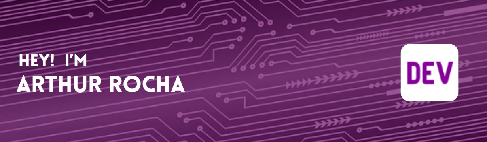

 
 &nbsp;&nbsp;&nbsp;

 
 &nbsp;
 &nbsp;
 
## My Skills

#### Main Stack:

&nbsp;
&nbsp;
&nbsp;
&nbsp;
&nbsp;
&nbsp;
&nbsp;
&nbsp;

#### Secondary Stack:

&nbsp;
&nbsp;

#### Studying in this moment:

&nbsp;
&nbsp;

#### Databases:

&nbsp;
&nbsp;

#### Workstation Tools:

&nbsp;
&nbsp;
&nbsp;
&nbsp;

&nbsp;
&nbsp;

## Contacts:

 

 

&nbsp;&nbsp;
 

  
  

